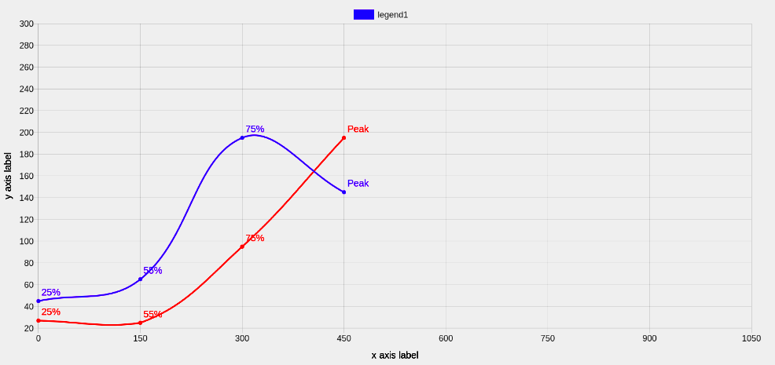

> The above image is the output of the code for this article.If you are desiring the same, you can continue reading this page.

> To display customize data labels for each coordinate in node.js using chart.js is a bit different or difficult. I did it by importing another third-party library that was definitely hard to implement initially, I had to read the documentation and went through many StackOverflow answers to find the solutions. So here I am documenting all of it together.

**Note**: I assume you already have installed and use chart.js and chartjs-node-canvas, if not you can check out this [link](https://ektaprasad.netlify.app/Chartjs-with-nodejs/)

## Installing packages

First install **chartjs-plugin-datalabels**

```
npm i chartjs-plugin-datalabels;
```

Now require it into your file :

```
const ChartDataLabels = require('chartjs-plugin-datalabels');
```

Then you need to write

```
const chartJsFactory = () => {
    const Chart = require('chart.js');
    require('chartjs-plugin-datalabels');
    delete require.cache[require.resolve('chart.js')];
    delete require.cache[require.resolve('chartjs-plugin-datalabels')];
    return Chart;
    }
```

Next, you need to customize the callback

```
const chartCallback = (ChartJS) => {
    ChartJS.plugins.register({
        ChartDataLabels
    });
};
```

Now for using this, you need to pass it on service like this:

```
const canvasRenderService = new CanvasRenderService(width, height, chartCallback, undefined,chartJsFactory);
```

###Customizing Plugin

You customize the plugin inside the nested object like this

```
configuration = {
  options:{
      plugin:{

      }
  }
}
```

Now you can customize the plugin as the way you want.I have written few customizable elements, you can checkout the documentation for more [here](https://chartjs-plugin-datalabels.netlify.app/guide/options.html#indexable-options)

```
plugins: {
    datalabels: {
        align: function(context) {
            return -45;
          },

        color: function(context) {
            return context.dataset.borderColor;
          },

        font: {
            size: 20,
            weight: 500
          },


        display: 'auto',  //hides overlapping data labels

        formatter: function(value, context) {
            if(value.indexLabel == '100%') {
                return 'Peak'
            }
            return value.indexLabel ;
        },
    }
  }
```

### Final code

Thank you for reading it till here. I hope it helps you.Below is the final code.

```
const { CanvasRenderService } = require('chartjs-node-canvas');
const ChartDataLabels = require('chartjs-plugin-datalabels');
const fs = require("fs");

const chartJsFactory = () => {
    const Chart = require('chart.js');
    require('chartjs-plugin-datalabels');
    delete require.cache[require.resolve('chart.js')];
    delete require.cache[require.resolve('chartjs-plugin-datalabels')];
    return Chart;
    }

const width = 1600;
const height = 750;
const chartCallback = (ChartJS) => {

    ChartJS.defaults.global.elements.point.pointStyle = "star";
    ChartJS.defaults.global.elements.point.radius = "4",
    ChartJS.defaults.global.elements.point.defaultFontSize = "90px",
    ChartJS.plugins.register({
        ChartDataLabels
    });


};
const canvasRenderService = new CanvasRenderService(width, height, chartCallback, undefined,chartJsFactory);


const createImage = async () => {
    let dataset1=[],dataset2=[],dataset3=[];

        dataset1 = [{x:123,y:45,indexLabel:'25%'},{x:115,y:65,indexLabel:'55%'},{x:128,y:195,indexLabel:'75%'},{x:723,y:145,indexLabel:'100%'}];
        dataset2 = [{x:239,y:27,indexLabel:'25%'},{x:498,y:25,indexLabel:'55%'},{x:318,y:95,indexLabel:'75%'},{x:933,y:195,indexLabel:'100%'}]


    const configuration = {
        type: 'line',
          data: {
              labels: [0,150,300,450,600,750,900,1050],
              datasets: [{
                  label: 'legend1',
                  data: dataset1,
                  fill: false,
                  borderColor: 'blue',
                  borderWidth: 3,
                  showLine: true,
                  xAxisID: 'xAxis1'
              },
              {
                  label: 'legend2',
                  data: dataset2,
                  fill: false,
                  borderColor: 'red',
                  borderWidth: 3,
                  xAxisID: 'xAxis1'
              }
              ],

          },
          options: {
            legend: {
                labels: {
                    filter: function(item, chart) {
                        return !item.text.includes('legend2'); // hides a particular legend
                    },
                    fontSize: 18
                }
            },
                  scales: {
                  xAxes:[
                      {
                      id:'xAxis1',
                        ticks: {
                            beginAtZero: false,
                            max: 1000,
                            stepSize:50,
                            fontSize: 18,
                        },
                        scaleLabel: {
                            display: true,
                            labelString: 'x axis label',
                            fontSize: 20,
                            fontColor:'black'
                          },

                     },
                    ],
                    yAxes: [{
                    display: true,
                    ticks: {
                        max: 300,
                        stepSize: 20,
                        fontSize: 18
                    },
                    scaleLabel: {
                        display: true,
                        labelString: 'y axis label',
                        fontSize: 20,
                        fontColor:'black'
                    }
                }],
              },

            plugins: {
                datalabels: {
                    align: function(context) {
                        return -45;
                      },

                    color: function(context) {
                        return context.dataset.borderColor;
                      },

                    font: {
                        size: 20,
                        weight: 500
                      },


                    display: 'auto',  //hides overlapping data labels

                    formatter: function(value, context) {
                        if(value.indexLabel == '100%') {
                            return 'Peak'
                        }
                        return value.indexLabel ;
                    },
                }
              }
          }
          }

    const dataUrl = await canvasRenderService.renderToDataURL(configuration);
    return dataUrl;
};

module.exports = {
createImage
}
```

Adios Amigo.
